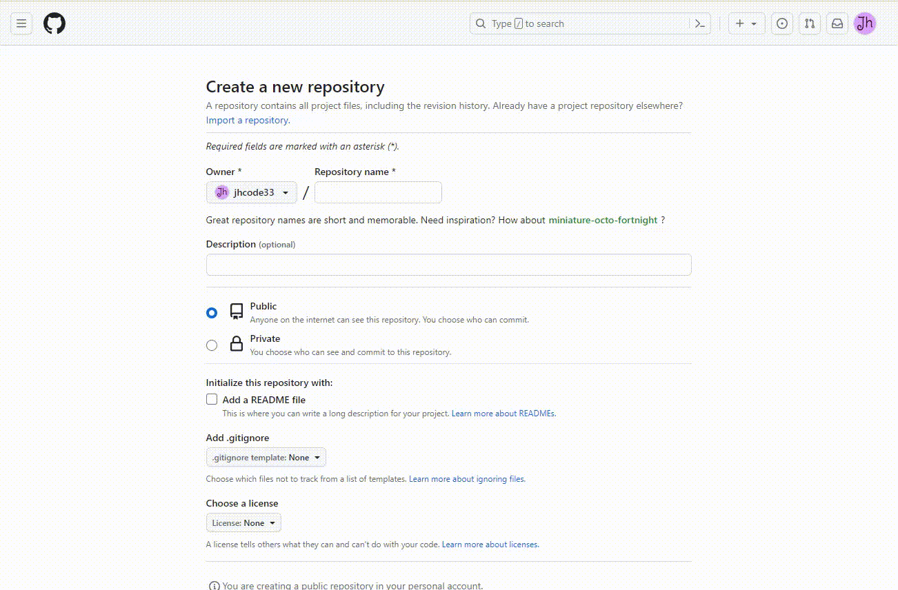
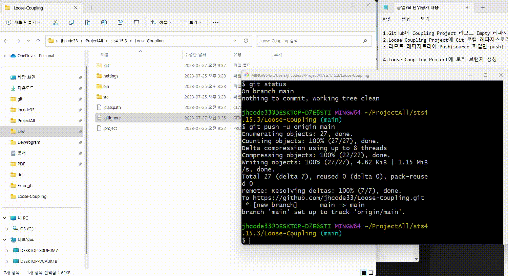

# Git 실습
Git 학습했던 내용들을 실제로 적용해 보았습니다. branch 생성, fast-forward merge, confilct merge, 3 way merge, remote branch와 local branch 충돌 해결 등의 문제를 직접해보았습니다. 마지막으로 team을 구성해 Collaborate를 진행해 각자 branch를 만들고 변경사항을 commit, push 후 팀장인 제가 remote에서 merge, local에서 merge를 진행했습니다.

# remote empty repo 생성

# git init & git push

# git local branch 생성

# fast-forward merge

# 3 way merge

# confilct merge

# remote branch 와 local branch 충돌 해결

# local branch 삭제

# git 마지막 commit 메세지 수정

# team-collaborate

